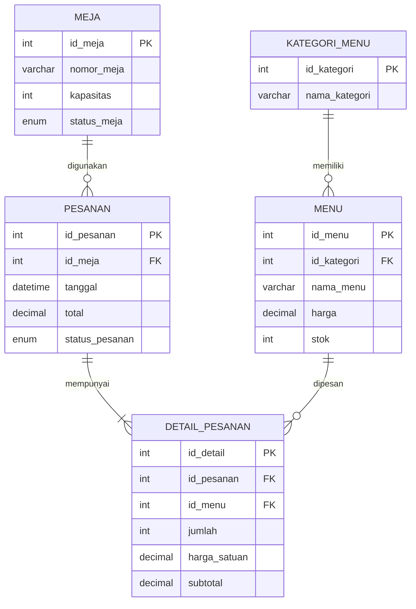

# ERD Sistem Pemesanan Makanan Restoran

```mermaid
erDiagram
    KATEGORI_MENU ||--o{ MENU : memiliki
    MEJA ||--o{ PESANAN : digunakan
    PESANAN ||--|{ DETAIL_PESANAN : mempunyai
    MENU ||--o{ DETAIL_PESANAN : dipesan

    KATEGORI_MENU {
        int id_kategori PK
        varchar nama_kategori
    }
    MENU {
        int id_menu PK
        int id_kategori FK
        varchar nama_menu
        decimal harga
        int stok
    }
    MEJA {
        int id_meja PK
        varchar nomor_meja
        int kapasitas
        enum status_meja
    }
    PESANAN {
        int id_pesanan PK
        int id_meja FK
        datetime tanggal
        decimal total
        enum status_pesanan
    }
    DETAIL_PESANAN {
        int id_detail PK
        int id_pesanan FK
        int id_menu FK
        int jumlah
        decimal harga_satuan
        decimal subtotal
    }
```
